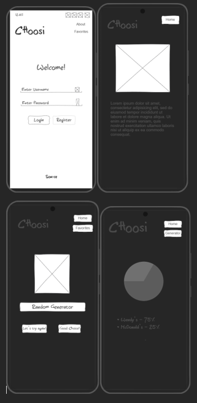

# Choosi

[My Notes](notes.md)

## 🚀 Specification Deliverable

> [!NOTE]
> For this deliverable I did the following. I checked the box `[x]` and added a description for things I completed.

- [x] Proper use of Markdown
- [x] A concise and compelling elevator pitch
- [x] Description of key features
- [x] Description of how you will use each technology
- [x] One or more rough sketches of your application. Images must be embedded in this file using Markdown image references.

### Elevator pitch

With all of the fast foods options today it can sometimes be difficult to pinpoint exactly what you are craving for. With Choosi, that decision is less daunting and fun! Instead of wasting time debating on food options, Choosi's takes the highest rated fast food places in your area and complies them into a random generator that you can use to figure out where to eat. Make life easier and let Choosi decide for you!

### Design

### Key features

- Secure login
- On login location is retrieved and stored for customization of fast-food choices
- Random generator is activated on login and location authentication
- Ability to choose randomly selected option or try again
- Dynamically updated pie-chart and table of percentages used to display user's past choices
- A page dedicated to explain the purpose of generator and how it works

### Technologies

I am going to use the required technologies in the following ways.

- **HTML** - Four different views: login, random fast food selection - play, user's most comman choices, purpose of application
- **CSS** - Cohesive and adaptive application styling, color scheme used to animate images for pages in place of current placeholder images
- **React** - Provides login, display random generator, display past options, backend endpoint calls. Faciliates movement between views/pages, and is reacive to user choices.
- **Service** - An [external API](https://www.abstractapi.com/api/ip-geolocation-api) is used to get user's location when they log in. Similary backend services with endpoints are needed to auntenticate users, and to retrieve and display selected choices.
- **DB/Login** - Stores user choices in database, which they can only view if logged in. Authenticate user login and store username and password in secure database.
- **WebSocket** - When user selects an option, pie-chart is updated reflecting all past selections and the amount of times they have selected an option in percentages.

## 🚀 AWS deliverable

For this deliverable I did the following. I checked the box `[x]` and added a description for things I completed.

- [x] **Server deployed and accessible with custom domain name** - [My server link](https://justjess260.click).

## 🚀 HTML deliverable

For this deliverable I did the following. I checked the box `[x]` and added a description for things I completed.

- [x] **HTML pages** - Four different view: index.html, favorites.html, about.html and play.html
- [x] **Proper HTML element usage** - Used understanding of elements and tags such as img, form and svg to create a useful draft of website
- [x] **Links** - Successfully links between views
- [x] **Text** - About page includes text about website and how generator works
- [x] **3rd party API placeholder** - Login also functions as placeholder for external API because user location is retrieved at login/registration
- [x] **Images** - Image used on about page
- [x] **Login placeholder** - Can be viewed on login page
- [x] **DB data placeholder** - Can be viewed on favorites page
- [x] **WebSocket placeholder** - SVG of piechart used as a placeholder on favorites page

## 🚀 CSS deliverable

For this deliverable I did the following. I checked the box `[x]` and added a description for things I completed.

- [x] **Header, footer, and main content body** - most of the editing of these elements are done on main.css.
- [x] **Navigation elements** - anchor colors and buttons change based on interaction with them.
- [x] **Responsive to window resizing** - App retains basic structure on all window sizes and devices.
- [x] **Application elements** - defined background, padding and positioning.
- [x] **Application text content** - consistent font style and text manipulation on about page.
- [x] **Application images** - styled image on about page.

## 🚀 React part 1: Routing deliverable

For this deliverable I did the following. I checked the box `[x]` and added a description for things I completed.

- [x] **Bundled using Vite** - Vite used to bundle JSX.
- [x] **Components** - JSX and css bundled into components based on page.
- [x] **Router** - Routing between login and generator/play page.

## 🚀 React part 2: Reactivity

For this deliverable I did the following. I checked the box `[x]` and added a description for things I completed.

- [ ] **All functionality implemented or mocked out** - I did not complete this part of the deliverable.
- [ ] **Hooks** - I did not complete this part of the deliverable.

## 🚀 Service deliverable

For this deliverable I did the following. I checked the box `[x]` and added a description for things I completed.

- [ ] **Node.js/Express HTTP service** - I did not complete this part of the deliverable.
- [ ] **Static middleware for frontend** - I did not complete this part of the deliverable.
- [ ] **Calls to third party endpoints** - I did not complete this part of the deliverable.
- [ ] **Backend service endpoints** - I did not complete this part of the deliverable.
- [ ] **Frontend calls service endpoints** - I did not complete this part of the deliverable.
- [ ] **Supports registration, login, logout, and restricted endpoint** - I did not complete this part of the deliverable.

## 🚀 DB dilverable

For this deliverable I did the following. I checked the box `[x]` and added a description for things I completed.

- [ ] **Stores data in MongoDB** - I did not complete this part of the deliverable.
- [ ] **Stores credentials in MongoDB** - I did not complete this part of the deliverable.

## 🚀 WebSocket deliverable

For this deliverable I did the following. I checked the box `[x]` and added a description for things I completed.

- [ ] **Backend listens for WebSocket connection** - I did not complete this part of the deliverable.
- [ ] **Frontend makes WebSocket connection** - I did not complete this part of the deliverable.
- [ ] **Data sent over WebSocket connection** - I did not complete this part of the deliverable.
- [ ] **WebSocket data displayed** - I did not complete this part of the deliverable.
- [ ] **Application is fully functional** - I did not complete this part of the deliverable.
